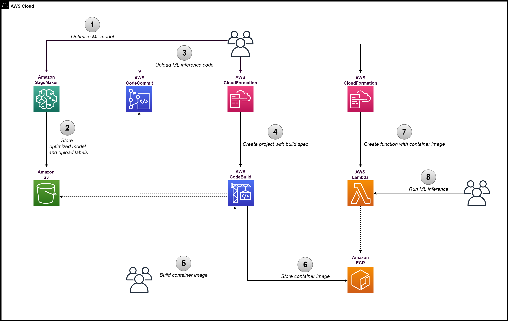

# Run ML inference on Lambda arm64 (AWS Graviton) using SageMaker Neo optimized ML models

This sample provides steps to run a ML model (optimized with SageMaker Neo) on AWS Lambda (arm64) by building and loading a container image. The Lambda function will be used to perform ML inference using an example image classification ML model in ONNX format (ResNet 50).

## Overview

[Amazon SageMaker Neo](https://aws.amazon.com/sagemaker/neo/) enables developers to optimize machine learning (ML) models for inference. It is one of the options available to perform CPU-based machine learning inference on [Graviton](https://aws.amazon.com/ec2/graviton/) instances.

## Prerequisites
* Ensure the AWS region selected supports [CodeBuild Arm containers](https://docs.aws.amazon.com/codebuild/latest/userguide/build-env-ref-compute-types.html)

## Limitations

* Any changes to the ML inference code require re-building the Docker container image and re-deploying it on Lambda

## Architecture



## Instructions

### Step 1. Optimize ML model

Download the [example model](./data/resnet50-v1-7.tar.gz).

Go to service Amazon S3 and upload the file to a S3 bucket (e.g. original-model).

Go to service Amazon SageMaker to create a compilation job.

Input configuration:

- **Location of model artifacts**: provide the S3 URI of the original model

- **Data input configuration**: provide "{"data": [1,3,224,224]}" for this model

- **Machine learning framework**: ONNX

Output configuration:

Select **Target platform**.

- **OS**: LINUX

- **Arch**: ARM64

- **S3 Output location**: provide a S3 bucket name (e.g. optimized-model)

Run the compilation job. After it succeeds, download the [labels file](./data/synset.txt) and upload it in the same S3 bucket as the optimized model.

### Step 2. Prepare code repository

Go to service AWS CodeCommit to create a new code repository. Upload to it the 2 files: [Dockerfile](./src/Dockerfile) and [app.py](./src/app.py) from this repository.

### Step 3. Build Docker container image

#### Create Codebuild project

Go to service AWS CloudFormation and create a new stack using the [CodeBuild template](./src/DeployCodeBuildProject-Cfn.yaml).

Parameters to provide:

- **CodeCommitRepositoryName**: provide name given in Step 2

- **ContainerImageName**: provide a name for the container image that will be created

- **ModelS3URI**: provide S3 location of model optimized in Step 1

- **LabelsS3URI**: provide S3 location of labels file uploaded in Step 1

#### Run build

Go to service AWS CodeBuild to locate the project created and to start a build to produce the Docker container image.

Go to service Amazon ECR and confirm the built container image is published there.

### Step 4. Deploy Lambda function

Go to service AWS CloudFormation and create a new stack using the [Lambda template](./src/DeployLambdaContainerImage-Cfn.yaml).

Parameters to provide:

- **LambdaMemorySize**: specify amount of memory required by ML inference code

The example code uses approximately 1GB of memory, however Lambda supports up to 3GB or 10GB depending on region availability.

### Step 5. Run ML Inference

Go to service AWS Lambda to view the function created in Step 4.

Test the ML inference code with a sample image by using this event:

```
{
  "image_url": "<<PROVIDE_IMAGE_URL>>"
}
```
Example image URL: https://s3.amazonaws.com/model-server/inputs/kitten.jpg

Confirm the output of the test shows the image classification results. Ignore the additional log output.

## References

* Neo-AI-DLR: https://github.com/neo-ai/neo-ai-dlr
* ONNX model: https://github.com/onnx/models/blob/main/vision/classification/resnet/model/resnet50-v1-7.tar.gz
* ONNX model labels: https://s3.amazonaws.com/onnx-model-zoo/synset.txt

## Additional Information

* To learn more about Lambda support for the arm64 architecture: https://docs.aws.amazon.com/lambda/latest/dg/foundation-arch.html
* For workloads which require more resources than Lambda provides, Amazon ECS or AWS Fargate are suitable alternatives to deploy the container image to. To learn more about ECS support for arm64 architecture: https://docs.aws.amazon.com/AmazonECS/latest/developerguide/ecs-arm64.html

## Contributing

See [CONTRIBUTING](./CONTRIBUTING.md) for more information.

## License

This sample code is made available under a MIT-0 license. See the [LICENSE](./LICENSE) file.
